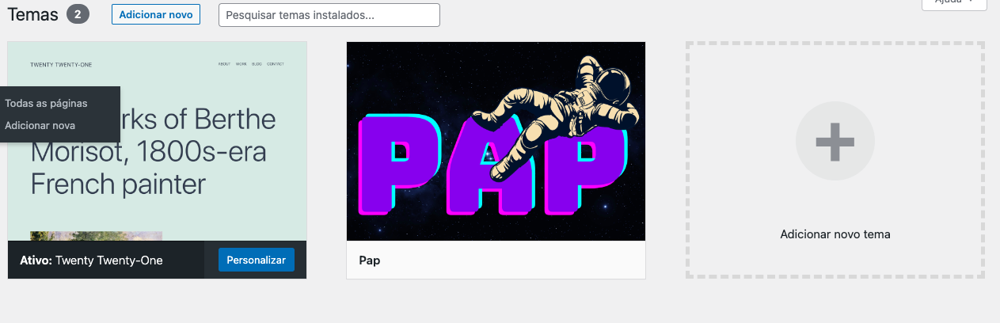

# Tema wordpress

Este é um tema WordPress lindo criado com Docker. O objetivo deste tema é fornecer uma base para um tema personalizado do WordPress que possa ser facilmente executado usando o Docker.

## Demostração dos aplicativos no front-end

<div style="max-width: 100%; overflow: hidden;">
    
</div>

### Imagem do tema 
<div style="max-width: 100%; overflow: hidden;">
    
</div>

## Como usar 


1. Certifique-se de ter o Docker instalado na sua máquina.
2. Clone este repositório para o seu computador.
3. Abra um terminal e navegue até o diretório do tema.
4. Execute o seguinte comando para construir a imagem do Docker:

```bash
docker build -t nome-da-sua-imagem .

```
5. Quando a imagem for construída, execute o seguinte comando para criar um contêiner com a imagem:
```bash
docker run -d -p 8080:80 nome-da-sua-imagem

```

6. Abra um navegador e vá para http://localhost:8080 para visualizar o tema WordPress.
7. Para editar o tema, abra o diretório "wp-content/themes" e adicione ou edite os arquivos do tema.

## Personalização

Este tema é uma base para um tema personalizado do WordPress. Para personalizar este tema, siga os seguintes passos:

1. Abra o diretório "wp-content/themes" e copie o diretório do tema para um novo diretório com o nome do seu tema.
2. Edite os arquivos no novo diretório para personalizar o tema.
3. Abra o arquivo Dockerfile e altere a linha que copia o diretório do tema para corresponder ao nome do seu novo diretório.
4. Construa uma nova imagem do Docker usando o comando docker build.
5. Crie um novo contêiner com a nova imagem do Docker usando o comando docker run.


## Tech Stack

**Tecnologias:** JavaScript, PHP, CSS, HTML

**Server:** XAMPP, PHP, Docker 

**Database:** MySQL 


## Contribuição

Se você gostaria de contribuir para este tema, sinta-se livre para enviar um pull request.


## Licença

[MIT](https://choosealicense.com/licenses/mit/)
